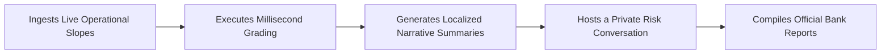

# CredCard AI

## Decentralized Edge-AI Underwriting Core

**CredCard AI** is a bank underwriting dashboard that allows relationship managers to evaluate a small business's risk in milliseconds using real-time data logs, while running its AI core completely on-premise to keep sensitive financial metrics 100% private.

**Built for modern commercial banking compliance and zero-overhead enterprise scaling.**

---

| Privacy | Speed | Compliance | Scale |
|---|---|---|---|
| On-premise AI core | Millisecond grading | Banking-ready workflows | Zero-overhead enterprise scaling |

---

## The Problem

> Imagine this everyday scenario in corporate banking:

A small business owner applies for a commercial credit card or loan. To evaluate them, the bank has to request months of outdated annual tax returns and audited balance sheets. A credit officer then manually keys this data into spreadsheets. The process takes days, requires manual phone calls to verify records, and often misses the business's real-time financial health.

If the bank tries to speed this up using standard cloud-hosted Artificial Intelligence, it runs directly into a legal brick wall. Strict institutional banking regulations, such as RBI guidelines and GDPR, heavily penalize banks that send private customer banking records, transaction logs, or sensitive financial telemetry over public networks to a third-party cloud server.

Today, commercial lenders are trapped in a slow, fragmented loop:

| Bottleneck | Reality |
|---|---|
| **The Speed Bottleneck** | Standard underwriting processes take too long, causing banks to lose prime MSME clients to faster fintech competitors. |
| **The Privacy Bottleneck** | Centralized cloud AI models are powerful, but risky or non-compliant to use with raw, un-redacted customer data. |
| **The Cost Bottleneck** | Hosting massive private language models in the cloud can cost thousands of dollars in monthly server fees, making automated underwriting expensive to scale. |

> CredCard AI fixes this by splitting the work: the deterministic scoring runs instantly in a clean web dashboard, while the AI analysis runs completely inside the bank's own local infrastructure.

---

## Plain-English Concepts

| Concept | Plain-English Meaning |
|---|---|
| **Alternative Corporate Telemetry** | High-frequency operational data points, such as utility power consumption slopes, daily digital payment variances, GST filing delays, employee growth changes, and factory power usage drops, that reveal how a company is performing right now instead of relying only on last year's tax forms. |
| **Deterministic Logic** | Code that executes strict mathematical rules with 100% consistency. AI can guess or hallucinate, but deterministic code never guesses. For example, standard math equations always produce the same result. |
| **Edge Inference** | Running a Large Language Model locally on the user's physical machine or private network, rather than sending sensitive data to an external cloud server. |

---

## What CredCard AI Does

CredCard AI is a hybrid cloud-edge web application that replaces manual loan sheets with automated data scoring and natural language risk analysis.

When an underwriting profile is loaded, the platform:

### 1. Ingests Live Operational Slopes

The **Alternative Corporate Telemetry Ingestion Array** gathers real-time performance inputs, including:

| Real-Time Inputs |
|---|
| GST filing delays |
| UPI cash flow changes |
| Employee growth shifts |
| Factory power usage drops |
| Other high-frequency business health indicators |

### 2. Executes Millisecond Grading

The **Deterministic Credit Scoring Engine** pushes those metrics through strict mathematical risk distributions in under 1 millisecond.

The numerical score is isolated from the AI layer, ensuring that the LLM cannot hallucinate or alter the financial grading logic.

### 3. Generates Localized Narrative Summaries

The **Automated Underwriter Advocacy Brief** runs inside the browser using a local AI core to summarize the core cash flow risk in two clear sentences.

### 4. Hosts a Private Risk Conversation

The **Decentralized Edge-AI Proprietary Credit Assistant** provides a secure chat interface where relationship managers can query historical anomalies safely on-premise.

### 5. Compiles Official Bank Reports

The **Cross-Origin State Synchronization Pipeline** packages the full evaluation thread, score grids, and AI summaries into a structured, audit-ready corporate PDF.

---

## Simple Analogy

> Think of CredCard AI like a secure bank vault with a digital security screen.

The screen sits on the outside wall, representing the hosted cloud dashboard that managers can interact with easily. But the actual vault holding the private documents, customer data, and LLM reasoning stays sealed inside the bank's own physical infrastructure.

> The screen can show the status, but the private documents never leave the vault.

---

## Why It Is Different

Most banking dashboards provide static numbers or generic risk scores. Underwriters need context.

CredCard AI improves the underwriting workflow in three major ways:

| Advantage | Impact |
|---|---|
| **Explains the "Why"** | It does not just say a score is low. It identifies why the score changed, such as electricity consumption dropping, staff count shrinking, delayed tax filings, or digital payment flows weakening. |
| **Enables Zero Cloud AI Infrastructure Cost** | The heavy AI processing runs on the host machine's hardware. Banks can scale the platform to thousands of managers globally without increasing cloud LLM server costs. |
| **Speaks the Credit Committee's Language** | CredCard AI bridges the gap between raw telemetry inputs and final approval workflows by generating formal, compliance-ready sanction memo PDFs instantly. |

---

## What This Tool Is Not

CredCard AI is deliberately scoped for responsible banking use.

| Boundary | Explanation |
|---|---|
| **It does not replace human credit committees.** | It flags anomalies, streamlines data entry, and improves decision support. Final risk tolerance thresholds and loan sign-off always remain with authorized bank officials. |
| **It is not a loose chatbot wrapper.** | The core credit score calculations are completely insulated from the AI layer. The LLM cannot hallucinate or change a numerical financial score because the math is executed through deterministic logic. |

---

## Who It Is For

| User | Value |
|---|---|
| **Bank Relationship Managers** | Get instant, readable summaries of a business's financial and operational health to speed up corporate card and loan evaluations. |
| **Credit Risk Underwriters** | Triage corporate applicants quickly with automated metric scoring, anomaly detection, and instant formal loan documentation. |
| **Financial Institutions** | Scale automated AI credit underwriting while maintaining strict compliance with data isolation, privacy, and institutional banking requirements. |

---

## Core Value Proposition

CredCard AI combines:

| Capability |
|---|
| Real-time alternative business telemetry |
| Deterministic credit scoring |
| Local edge-based AI inference |
| Private on-premise risk conversation |
| Audit-ready sanction memo generation |

> The result is a faster, cheaper, and privacy-preserving underwriting workflow for modern commercial banking.

---

## For Technical Readers

The full engineering blueprint (architecture, synchronization patterns, and verification mechanisms) is implemented across decoupled execution models. In short:

| Layer | Implementation |
|---|---|
| **Backend** | Python 3.10+ + Flask; numerical evaluations handled via a 1ms **Deterministic Credit Scoring Engine** (`scoring_engine.py`); cross-origin local payload translation managed via native JSON endpoints. |
| **Local Cognitive Hub** | Localized **Ollama** framework serving an optimized **Llama 3.2 (3B)** model with an **8k context window**; prompt-restrained assistant layer with rolling text memory truncation algorithms to preserve execution stability and manage context loops. |
| **State Bridge & Output** | A low-latency **Cross-Origin State Synchronization Pipeline** (`/sync_brief_to_history`) linking browser AI insights to a server-side **ReportLab Corporate Document Compiler** (`pdf_generator.py`) that packages telemetry graphs and score labels into a binary-streamed Sanction Memo PDF. |
| **Honest by Design** | AI outputs function strictly as narrative risk accelerators and qualitative context markers. Numerical scores are insulated entirely from generative hallucinations via pure Python logic constraints. |

---

## Documentation

All core application logic and structural components are kept completely modular so the repository root stays clean:

| File | Purpose |
|---|---|
| `app_flask.py` | **Start Here:** The primary Flask routing controller, synchronization hub, and server session management loop. |
| `scoring_engine.py` | The algorithmic credit calculator executing risk weight matrices in under 1ms. |
| `pdf_generator.py` | The programmatic document engine converting raw metrics and synced AI briefs into binary PDF downloads. |
| `ai_engine.py` & `ai_training.py` | The core local model routing layer and context engineering templates. |
| `templates/index.html` | The user interface dashboard hosting the telemetry form and managing the local hardware edge routing loopbacks. |

> Only the application code, the requirements manifest, and this `README.md` occupy the workspace root to ensure clean continuous integration and zero-overhead maintenance patterns.

---

## Project Status

| Phase | Status | Description |
|---|---|---|
| **Phase 1 (Core Hybrid Pipeline Architecture)** | **COMPLETED** | The application successfully decouples mathematical computations from natural language reasoning. The local AI core seamlessly communicates with the live dashboard interface via browser edge loops, and the cross-origin state synchronization engine successfully formats and builds the ReportLab document compiler. |
| **Phase 2 (Advanced Telemetry & Secure Environment Expansion)** | **ON HOLD** | Awaiting a proper Semantic Financial Dataset and isolated sandbox database environments to carry out extended real-world stress testing and full enterprise production mapping. |
